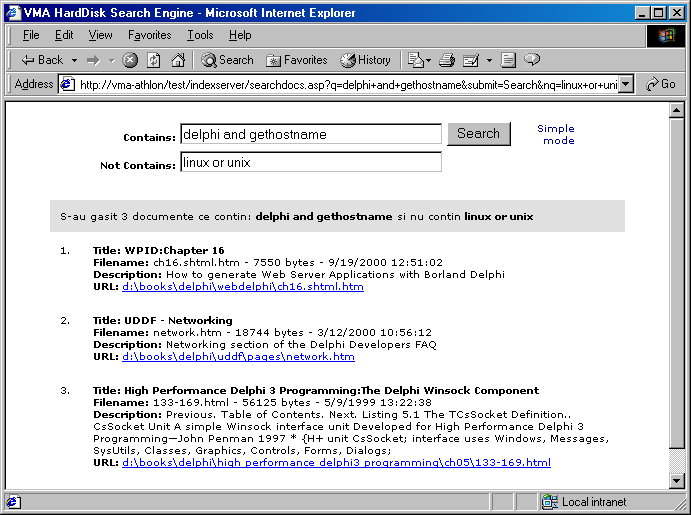

HDD Search Engine
=================

Last update: 2001

This project shows how to use Index Server to implement a search engine for the local HDD.
For more information please consult the [/doc](/doc) folder.

Note: This project has been used to backup the article with the same name published in "NET Report" magazine.

VMA
